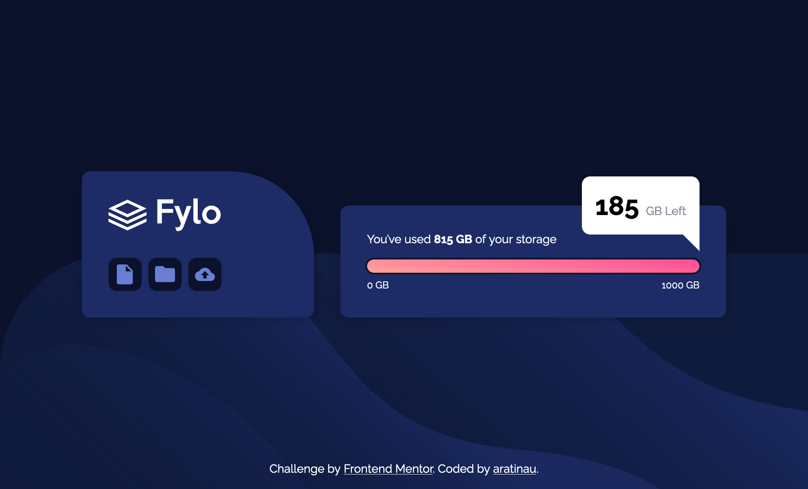
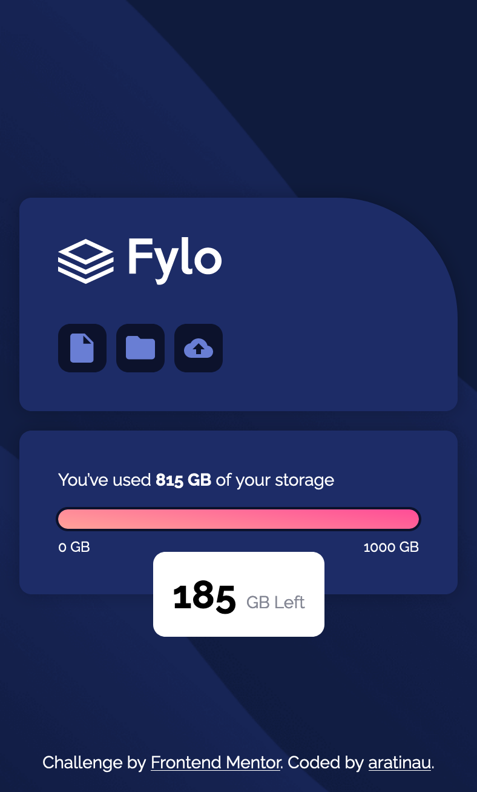

# Frontend Mentor - Fylo data storage component


This is a solution to the [Fylo data storage component challenge on Frontend Mentor](https://www.frontendmentor.io/challenges/fylo-data-storage-component-1dZPRbV5n). Frontend Mentor challenges help you improve your coding skills by building realistic projects.

## Table of contents

- [Overview](#overview)
    - [The challenge](#the-challenge)
    - [Screenshot](#screenshot)
  - [Links](#links)
- [My process](#my-process)
    - [Built with](#built-with)
    - [What I learned](#what-i-learned)

## Overview

### The challenge

Users should be able to:

- View the optimal layout depending on their device's screen size

### Screenshot




### Links

[Demo](https://curious-rolypoly-2e7455.netlify.app/)

## My process

### Built with

- CSS
- Flexbox

### What I learned

I'm happy with the way I made my triangle. I used `::after` on the bubble.

```css
.space-left-bubble::after {
    content: " ";
    position: absolute;
    bottom: 0;
    right: 0;
    height: 15px;
    width: 15px;

    /* triangle part */
    --size-triangle: 20px;
    border-top: var(--size-triangle) solid white;
    border-left: var(--size-triangle) solid transparent;
    transform: translateY(var(--size-triangle));
}
```
